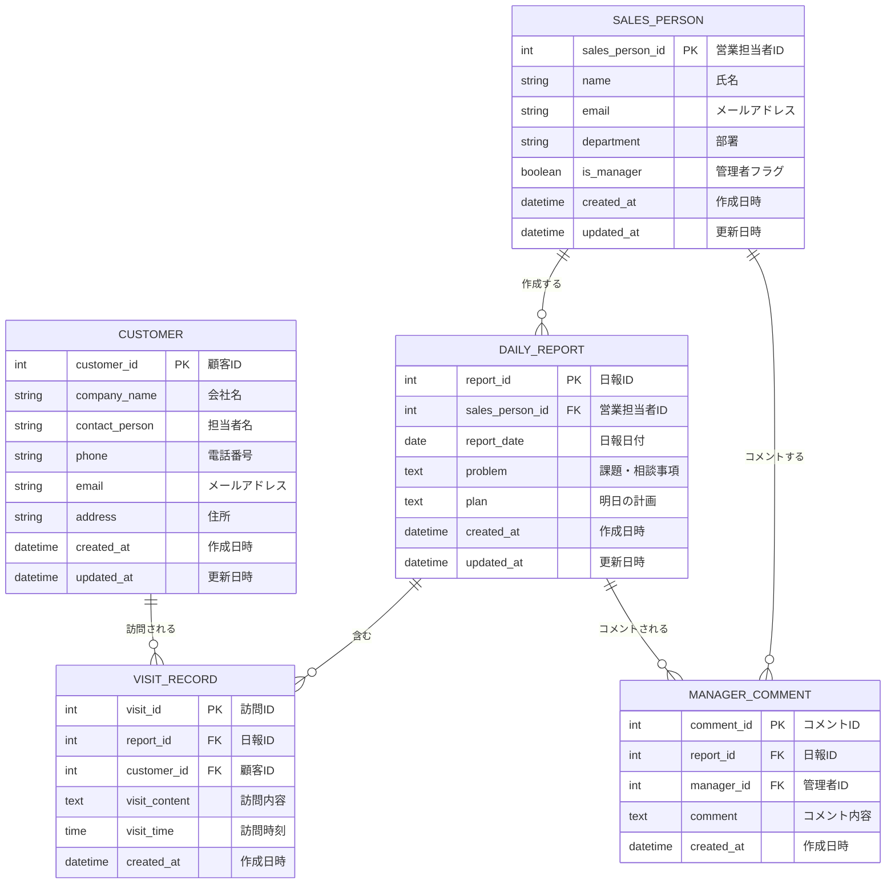

```mermaid
erDiagram
    %% 営業マスタ
    SALES_PERSON {
        int sales_person_id PK "営業担当者ID"
        string name "氏名"
        string email "メールアドレス"
        string department "部署"
        boolean is_manager "管理者フラグ"
        datetime created_at "作成日時"
        datetime updated_at "更新日時"
    }

    %% 顧客マスタ
    CUSTOMER {
        int customer_id PK "顧客ID"
        string company_name "会社名"
        string contact_person "担当者名"
        string phone "電話番号"
        string email "メールアドレス"
        string address "住所"
        datetime created_at "作成日時"
        datetime updated_at "更新日時"
    }

    %% 日報
    DAILY_REPORT {
        int report_id PK "日報ID"
        int sales_person_id FK "営業担当者ID"
        date report_date "日報日付"
        text problem "課題・相談事項"
        text plan "明日の計画"
        datetime created_at "作成日時"
        datetime updated_at "更新日時"
    }

    %% 訪問記録
    VISIT_RECORD {
        int visit_id PK "訪問ID"
        int report_id FK "日報ID"
        int customer_id FK "顧客ID"
        text visit_content "訪問内容"
        time visit_time "訪問時刻"
        datetime created_at "作成日時"
    }

    %% 上長コメント
    MANAGER_COMMENT {
        int comment_id PK "コメントID"
        int report_id FK "日報ID"
        int manager_id FK "管理者ID"
        text comment "コメント内容"
        datetime created_at "作成日時"
    }

    %% リレーションシップ
    SALES_PERSON ||--o{ DAILY_REPORT : "作成する"
    DAILY_REPORT ||--o{ VISIT_RECORD : "含む"
    CUSTOMER ||--o{ VISIT_RECORD : "訪問される"
    DAILY_REPORT ||--o{ MANAGER_COMMENT : "コメントされる"
    SALES_PERSON ||--o{ MANAGER_COMMENT : "コメントする"
```
