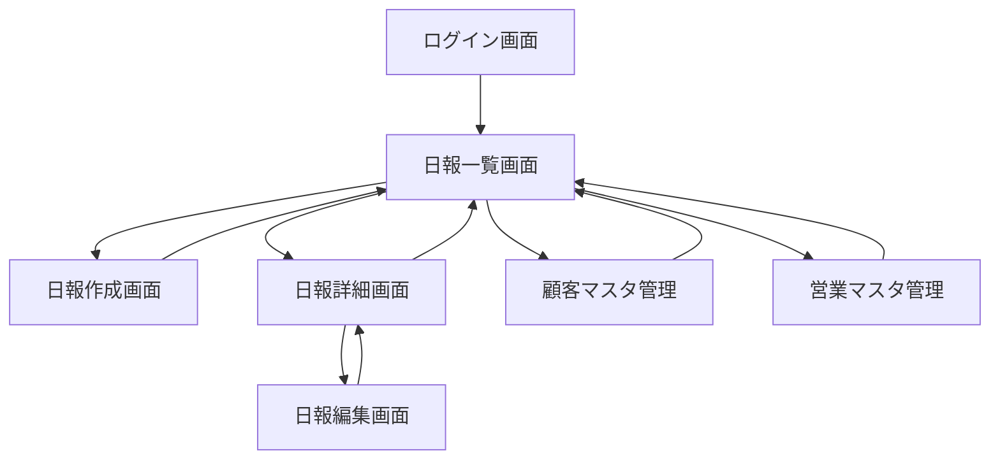

# 営業日報システム画面定義書

## 1. 画面一覧

| 画面ID | 画面名 | 概要 | 利用者 |
|--------|--------|------|--------|
| SC001 | ログイン画面 | システムへのログイン | 全ユーザー |
| SC002 | 日報一覧画面 | 日報の一覧表示・検索 | 全ユーザー |
| SC003 | 日報作成画面 | 新規日報の作成 | 営業担当者 |
| SC004 | 日報編集画面 | 既存日報の編集 | 営業担当者 |
| SC005 | 日報詳細画面 | 日報の詳細表示・コメント | 全ユーザー |
| SC006 | 顧客マスタ管理画面 | 顧客情報の管理 | 管理者 |
| SC007 | 営業マスタ管理画面 | 営業担当者の管理 | 管理者 |

## 2. 画面詳細

### 2.1 ログイン画面（SC001）

#### 画面レイアウト
```
+----------------------------------+
|        営業日報システム          |
+----------------------------------+
|                                  |
|    メールアドレス：              |
|    [________________]            |
|                                  |
|    パスワード：                  |
|    [________________]            |
|                                  |
|    [ログイン]                    |
|                                  |
+----------------------------------+
```

#### 画面項目
| 項目名 | 種別 | 必須 | 説明 |
|--------|------|------|------|
| メールアドレス | 入力 | ○ | ログイン用メールアドレス |
| パスワード | 入力 | ○ | パスワード（マスク表示） |
| ログインボタン | ボタン | - | ログイン処理実行 |

### 2.2 日報一覧画面（SC002）

#### 画面レイアウト
```
+----------------------------------+
| 営業日報システム    [ログアウト] |
+----------------------------------+
| [新規日報作成]                   |
+----------------------------------+
| 検索条件                         |
| 期間：[____/___] ～ [____/___]   |
| 営業担当：[▼選択してください]    |
| [検索]                           |
+----------------------------------+
| 日付 | 営業担当 | 顧客数 | 状態 |
|------|----------|--------|------|
| 7/27 | 山田太郎 | 3件    |[詳細]|
| 7/26 | 山田太郎 | 5件    |[詳細]|
| 7/25 | 田中花子 | 2件    |[詳細]|
+----------------------------------+
```

#### 画面項目
| 項目名 | 種別 | 必須 | 説明 |
|--------|------|------|------|
| 新規日報作成 | ボタン | - | 日報作成画面へ遷移 |
| 期間（開始） | 日付入力 | - | 検索期間の開始日 |
| 期間（終了） | 日付入力 | - | 検索期間の終了日 |
| 営業担当 | 選択 | - | 営業担当者で絞り込み（管理者のみ） |
| 検索 | ボタン | - | 検索実行 |
| 日報一覧 | 表 | - | 日報の一覧表示 |
| 詳細 | リンク | - | 日報詳細画面へ遷移 |

### 2.3 日報作成画面（SC003）

#### 画面レイアウト
```
+----------------------------------+
| 営業日報システム    [ログアウト] |
+----------------------------------+
| 日報作成                         |
+----------------------------------+
| 日付：2025/07/27                 |
| 作成者：山田太郎                 |
+----------------------------------+
| ■ 訪問記録                      |
| [＋訪問記録を追加]               |
|                                  |
| 顧客名：[▼選択]                 |
| 訪問時刻：[__:__]                |
| 訪問内容：                       |
| [________________________]       |
| [________________________]       |
| [削除]                           |
+----------------------------------+
| ■ 本日の課題・相談（Problem）   |
| [________________________]       |
| [________________________]       |
| [________________________]       |
|                                  |
| ■ 明日の計画（Plan）            |
| [________________________]       |
| [________________________]       |
| [________________________]       |
+----------------------------------+
| [保存] [キャンセル]              |
+----------------------------------+
```

#### 画面項目
| 項目名 | 種別 | 必須 | 説明 |
|--------|------|------|------|
| 日付 | 表示 | - | 本日日付（自動設定） |
| 作成者 | 表示 | - | ログインユーザー名 |
| 訪問記録追加 | ボタン | - | 訪問記録入力欄を追加 |
| 顧客名 | 選択 | ○ | 顧客マスタから選択 |
| 訪問時刻 | 時刻入力 | - | 訪問時刻（任意） |
| 訪問内容 | テキストエリア | ○ | 訪問内容（最大500文字） |
| 削除 | ボタン | - | 該当訪問記録を削除 |
| 課題・相談 | テキストエリア | ○ | 本日の課題（最大1000文字） |
| 明日の計画 | テキストエリア | ○ | 明日の計画（最大1000文字） |
| 保存 | ボタン | - | 日報を保存 |
| キャンセル | ボタン | - | 一覧画面へ戻る |

### 2.4 日報編集画面（SC004）

#### 画面レイアウト
※ 日報作成画面と同様（既存データが表示される）

#### 画面項目
※ 日報作成画面と同様

### 2.5 日報詳細画面（SC005）

#### 画面レイアウト
```
+----------------------------------+
| 営業日報システム    [ログアウト] |
+----------------------------------+
| 日報詳細                         |
+----------------------------------+
| 日付：2025/07/27                 |
| 作成者：山田太郎                 |
| [編集]（作成者のみ表示）         |
+----------------------------------+
| ■ 訪問記録                      |
| 1. ABC商事（10:00）              |
|    新商品の提案を実施。          |
|    次回見積もり提出予定。        |
|                                  |
| 2. XYZ工業（14:00）              |
|    既存システムの保守相談。      |
+----------------------------------+
| ■ 本日の課題・相談（Problem）   |
| ・新規開拓の進捗が遅れている     |
| ・競合他社の動向について情報収集 |
|                                  |
| ■ 明日の計画（Plan）            |
| ・ABC商事への見積もり作成       |
| ・新規リスト50件に電話アプローチ |
+----------------------------------+
| ■ 上長コメント                  |
| 田中部長（7/27 18:00）：         |
| 新規開拓については明日相談しま   |
| しょう。                         |
|                                  |
| [コメントを追加]（管理者のみ）   |
| [________________________]       |
| [投稿]                           |
+----------------------------------+
| [戻る]                           |
+----------------------------------+
```

#### 画面項目
| 項目名 | 種別 | 必須 | 説明 |
|--------|------|------|------|
| 編集 | ボタン | - | 編集画面へ遷移（作成者のみ） |
| 訪問記録 | 表示 | - | 訪問記録の一覧表示 |
| 課題・相談 | 表示 | - | 記載内容を表示 |
| 明日の計画 | 表示 | - | 記載内容を表示 |
| コメント一覧 | 表示 | - | 上長コメントの履歴 |
| コメント入力 | テキストエリア | ○ | コメント入力（管理者のみ） |
| 投稿 | ボタン | - | コメント投稿（管理者のみ） |
| 戻る | ボタン | - | 一覧画面へ戻る |

### 2.6 顧客マスタ管理画面（SC006）

#### 画面レイアウト
```
+----------------------------------+
| 営業日報システム    [ログアウト] |
+----------------------------------+
| 顧客マスタ管理                   |
+----------------------------------+
| [新規登録]                       |
+----------------------------------+
| 検索：[_______________] [検索]   |
+----------------------------------+
| 会社名 | 担当者 | 電話 | 操作   |
|--------|---------|------|--------|
| ABC商事| 佐藤一郎 | 03-xx|[編集] |
| XYZ工業| 鈴木二郎 | 06-xx|[編集] |
+----------------------------------+
```

#### 画面項目
| 項目名 | 種別 | 必須 | 説明 |
|--------|------|------|------|
| 新規登録 | ボタン | - | 顧客新規登録ダイアログ表示 |
| 検索 | 入力 | - | 会社名/担当者名で検索 |
| 顧客一覧 | 表 | - | 顧客情報の一覧 |
| 編集 | ボタン | - | 顧客情報編集ダイアログ表示 |

### 2.7 営業マスタ管理画面（SC007）

#### 画面レイアウト
```
+----------------------------------+
| 営業日報システム    [ログアウト] |
+----------------------------------+
| 営業担当者管理                   |
+----------------------------------+
| [新規登録]                       |
+----------------------------------+
| 氏名 | メール | 部署 | 権限 | 操作 |
|------|---------|------|------|------|
| 山田 | yamada@ | 営業1| 一般 |[編集]|
| 田中 | tanaka@ | 営業1| 管理 |[編集]|
+----------------------------------+
```

#### 画面項目
| 項目名 | 種別 | 必須 | 説明 |
|--------|------|------|------|
| 新規登録 | ボタン | - | 営業担当者登録ダイアログ表示 |
| 営業担当者一覧 | 表 | - | 営業担当者の一覧 |
| 編集 | ボタン | - | 営業担当者編集ダイアログ表示 |

## 3. 画面遷移図



## 4. 権限による表示制御

### 4.1 営業担当者（一般）
- 自分の日報のみ作成・編集・閲覧可能
- 他者の日報は閲覧のみ可能
- マスタ管理画面へのアクセス不可

### 4.2 管理者
- 全ての日報の閲覧・コメント可能
- 日報の作成・編集は自分のもののみ
- マスタ管理画面へのアクセス可能

## 5. バリデーション一覧

| 画面 | 項目 | バリデーション |
|------|------|----------------|
| ログイン | メールアドレス | 必須、メール形式 |
| ログイン | パスワード | 必須、8文字以上 |
| 日報作成 | 訪問内容 | 必須、最大500文字 |
| 日報作成 | 課題・相談 | 必須、最大1000文字 |
| 日報作成 | 明日の計画 | 必須、最大1000文字 |
| 日報詳細 | コメント | 必須、最大500文字 |

## 6. エラーメッセージ

| エラー種別 | メッセージ |
|------------|------------|
| 必須エラー | {項目名}は必須項目です |
| 文字数超過 | {項目名}は{最大文字数}文字以内で入力してください |
| 重複エラー | 同じ日付の日報が既に存在します |
| 権限エラー | この操作を行う権限がありません |
| ログインエラー | メールアドレスまたはパスワードが正しくありません |